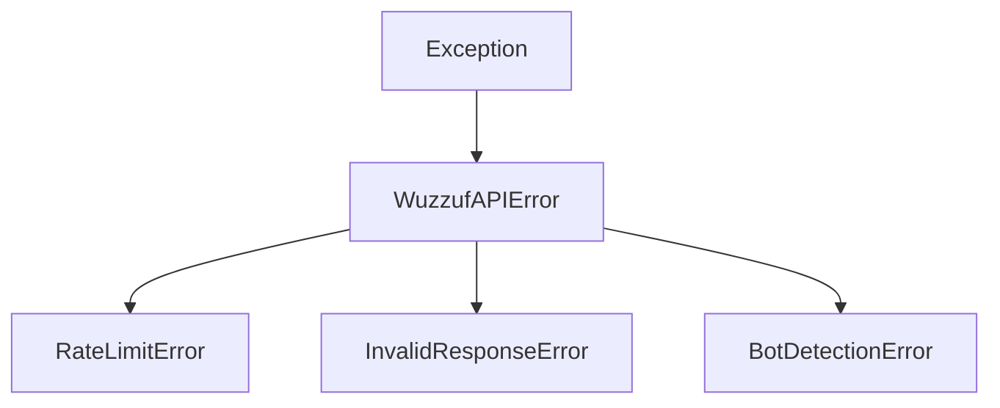

# Exceptions Reference

PyWuzzuf provides a custom exception hierarchy to handle API errors and validation issues gracefully.

## Hierarchy

All exceptions inherit from `WuzzufAPIError`, allowing you to catch specific errors or handle all client errors with a single block.



## Base Exception

### WuzzufAPIError

**Base class for all PyWuzzuf errors.**

This is the recommended catch-all for production scripts where you want to log errors but keep the pipeline running.

```python
import asyncio
from pywuzzuf import WuzzufClient, WuzzufAPIError

async def main():
    try:
        async with WuzzufClient() as client:
            result = await client.jobs.search("Python").all()
    except WuzzufAPIError as e:
        # Handles RateLimit, BotDetection, and InvalidResponse
        print(f"API Error (HTTP {e.status_code}): {e}")
        # Log to sentry/file
        pass

if __name__ == "__main__":
    asyncio.run(main())
```

| Attribute | Type | Description |
| :--- | :--- | :--- |
| `status_code` | `int` | The HTTP status code returned by the API. |
| `args[0]` | `str` | The detailed error message. |

---

## Critical Errors

### BotDetectionError

**Raised when repeated HTTP 403 responses are detected.**

This error indicates that Wuzzuf has flagged the client as a bot.

```python
from pywuzzuf import BotDetectionError

try:
    # ... search logic ...
except BotDetectionError as e:
    print(f"Blocked by Wuzzuf: {e}")
    # Recommended Action: Update impersonate string or use proxies
```

**Recommended Resolution:**

1.  **Update Fingerprint**: Change the `impersonate` parameter to a newer browser version (e.g., `"chrome124"`).
2.  **Proxies**: Route traffic through a residential proxy.
3.  **Slow Down**: Add delays between pagination calls.

!!! warning "Automatic Retry"
    This error is only raised after **3 consecutive 403 responses**. The client attempts to proceed with retries before finally raising this exception.

---

## Network & API Errors

### RateLimitError

**Raised when HTTP 429 is encountered after retries.**

The client automatically retries on `429` responses with exponential back-off. If the limit persists after 5 attempts, this exception is raised.

| Attribute | Type | Description |
| :--- | :--- | :--- |
| `status_code` | `int` | Always `429`. |

**Action:** Wait a few minutes before restarting your script.

### InvalidResponseError

**Raised when API response validation fails.**

This usually indicates that the Wuzzuf API schema has changed, or the response was malformed (e.g., expecting a `dict` but got a `str`).

```python
from pywuzzuf import InvalidResponseError

try:
    # ... search logic ...
except InvalidResponseError as e:
    print(f"Validation failed: {e.validation_error}")
```

| Attribute | Type | Description |
| :--- | :--- | :--- |
| `validation_error` | `Exception` | The underlying Pydantic validation error. |

---

## Best Practices

### The Production Wrapper

For robust scripts, wrap your entry point in a `try/except` block that catches `WuzzufAPIError`. This ensures that network blips or API changes don't crash your entire pipeline unexpectedly.

```python
import asyncio
import logging
from pywuzzuf import WuzzufClient, WuzzufAPIError

logging.basicConfig(level=logging.INFO)

async def fetch_jobs():
    async with WuzzufClient() as client:
        return await client.jobs.search("Python").limit(100).all()

async def main():
    try:
        jobs = await fetch_jobs()
        logging.info(f"Successfully processed {len(jobs.items)} jobs.")
    except WuzzufAPIError as e:
        logging.error(f"Failed to fetch jobs: {e}")
        # Implement retry logic or alerting here

if __name__ == "__main__":
    asyncio.run(main())
```
